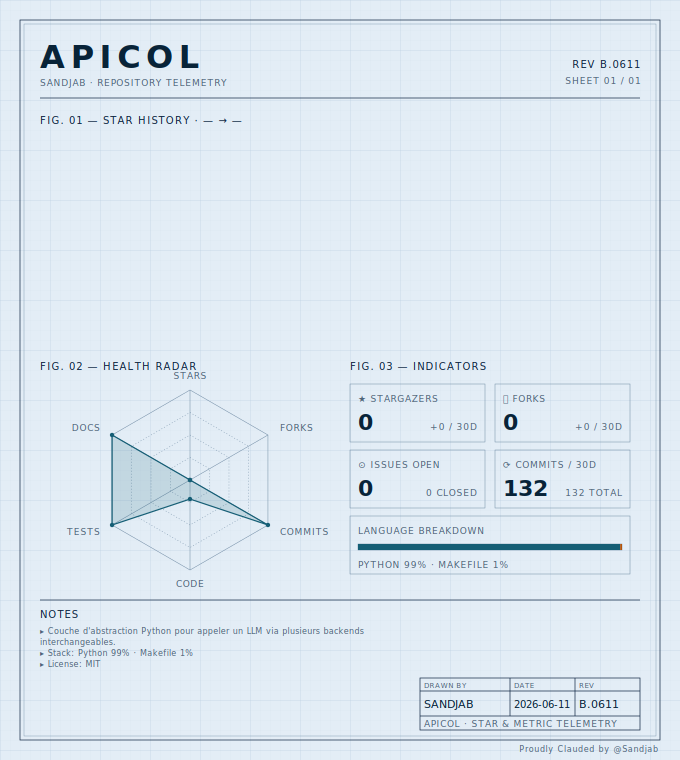

# apicol

[](https://github.com/Sandjab/apicol/actions/workflows/ci.yml)
[](https://github.com/Sandjab/apicol/commits/main)
[](LICENSE)
[](https://www.python.org)
[](https://github.com/Sandjab/apicol/releases/tag/v0.3.0)
[](https://github.com/Sandjab/apicol)

Couche d'abstraction Python pour appeler un LLM via plusieurs backends interchangeables. Une interface unifiée au format OpenAI pour parler à : **API Anthropic native** (avec caching, thinking, citations), **OpenAI-compatible** via le SDK officiel `openai` (OpenAI, Mistral, Ollama, vLLM, LM Studio, OpenRouter, Groq, DeepSeek, Together, Fireworks et tout endpoint qui expose `/v1/chat/completions`), **LiteLLM** pour les providers non-OpenAI-compatibles natifs (Gemini natif, Bedrock, Vertex AI, Azure OpenAI, Cohere), et **Claude Code CLI** (`claude -p`, usage dev local uniquement).

Sélection du backend par variables d'environnement *ou* par objet `Client` configurable. Plusieurs backends peuvent cohabiter dans le même process (bench, fallback applicatif, comparaison).

## Statut

**v0.3.0 — alpha.** Implémentation complète des quatre backends (Anthropic natif, OpenAI-compatible, LiteLLM, `claude -p` dev-only), surface publique stable, ≥95 % de couverture. Streaming livré en v0.3.0 (`stream()`/`astream()` sur les 3 backends routables). Tool calls reportés à v0.3 (prochain cycle), embeddings à v0.4. Documentation associée :

- `README.md` — ce fichier
- `CLAUDE.md` — instructions pour Claude Code travaillant sur ce repo
- `ARCHITECTURE.md` — décisions techniques structurantes
- `SPEC.md` — contrat d'API publique
- `CHANGELOG.md` — historique des versions
- `pyproject.toml` — métadonnées du package
- `docs/prd/` — PRD-001 (architecture deux niveaux), PRD-002 (séparation `claude -p`), PRD-003 (multi-backend simultané), PRD-004 (backend `openai-compatible`), PRD-005 (streaming)

## Pourquoi cette lib

LiteLLM résout une partie du problème (interface unifiée, 100+ providers, format OpenAI partout). `apicol` ajoute trois choses que LiteLLM seul ne fait pas bien :

1. **Un chemin Anthropic natif préservé.** Le compatibility layer OpenAI d'Anthropic ne supporte ni le prompt caching avec breakpoints fins ni le détail du thinking. Pour les usages long-context avec caching agressif, il faut le SDK Anthropic natif. `apicol` expose explicitement cette voie quand `APICOL_TYPE=anthropic`, via une méthode `client.anthropic_native()`.
2. **Un chemin direct SDK OpenAI** pour les endpoints OpenAI-compatibles (OpenAI, Mistral, Ollama, vLLM, LM Studio, OpenRouter, Groq, DeepSeek…). Pas besoin de charger LiteLLM pour parler à Ollama. Headers de connexion typés (`extra_headers`) utiles pour OpenRouter (`HTTP-Referer`, `X-Title`).
3. **Un backend `claude -p`** pour le dev local interactif. Strictement marqué « dev only » et exposé via une fonction séparée — **pas** routé dans l'interface unifiée — pour éviter toute confusion avec un usage programmatique qui violerait les TOS Anthropic (voir PRD-002).

LiteLLM reste pour ce qu'il fait vraiment bien : les providers qui ne parlent pas OpenAI nativement (Gemini natif Google AI Studio / Vertex AI, Bedrock, Azure OpenAI, Cohere, Replicate, HuggingFace Inference). Voir [PRD-004](docs/prd/PRD-004-backend-openai-compatible.md) pour le détail du tradeoff.

### Quel backend choisir ?

| Tu veux parler à… | Utilise |
|---|---|
| OpenAI, Mistral, Ollama, vLLM, LM Studio, OpenRouter, Groq, DeepSeek, Together, Fireworks, Anyscale, ou tout proxy OpenAI-compatible | `backend="openai-compatible"` |
| Gemini natif (Google AI Studio / Vertex AI), Bedrock, Azure OpenAI, Cohere, Replicate, HuggingFace Inference | `backend="litellm"` |
| API Anthropic native avec caching fin, citations, PDF, batch, thinking détaillé | `backend="anthropic"` |
| `claude -p` localement (dev only) | `claude_cli_chat()` (fonction séparée, pas un backend de `chat()`) |

## Installation

### Depuis PyPI (cible v0.2.0)

```bash
pip install apicol
```

### Depuis le repo Git (phase alpha)

```bash
# Dernière version de main
pip install git+https://github.com/Sandjab/apicol.git

# Tag spécifique
pip install git+https://github.com/Sandjab/apicol.git@v0.2.0

# Branche dev
pip install git+https://github.com/Sandjab/apicol.git@dev
```

### Installation editable (dev local)

```bash
git clone https://github.com/Sandjab/apicol.git
cd apicol
pip install -e ".[dev]"  # base + outils dev (pytest, ruff, mypy)
```

### Ajout en dépendance d'un projet tiers

**Dans `pyproject.toml`** (par exemple celui d'Athanor) :

```toml
[project]
dependencies = [
    "apicol>=0.2.0",
    # OU depuis git en phase alpha
    "apicol @ git+https://github.com/Sandjab/apicol.git@main",
]
```

**Dans `requirements.txt`** :

```
apicol>=0.2.0
```

**Avec uv** :

```bash
uv add apicol
# ou depuis git
uv add "apicol @ git+https://github.com/Sandjab/apicol.git"
```

### Dépendances installées

`apicol` installe automatiquement :

- `anthropic` (SDK natif pour le backend Anthropic et l'échappatoire native)
- `openai` (SDK officiel pour le backend `openai-compatible`)
- `litellm` (délégation pour les providers natifs exotiques : Gemini, Bedrock, Vertex AI, Azure, Cohere)

Python ≥ 3.10 requis.

## Variables d'environnement

| Variable | Valeurs | Rôle |
|----------|---------|------|
| `APICOL_TYPE` | `anthropic`, `openai-compatible`, `litellm` | Backend utilisé par les fonctions globales `chat`, `achat` |
| `APICOL_KEY` | string | Clé d'API |
| `APICOL_MODEL` | string | Modèle (ex. `claude-opus-4-7`, `gpt-5`, `qwen3:32b`, `gemini/gemini-2.5-pro`) |
| `APICOL_URL` | URL (optionnel) | Endpoint custom (vLLM, Ollama, LM Studio, OpenRouter, gateway…) |

Pour `claude_cli_chat()` aucune variable n'est requise.

Pour un usage **multi-backend simultané**, ces variables ne sont pas suffisantes — on construit des `Client` explicites (voir Usage ci-dessous).

## Usage

### Mode simple — fonctions globales et env vars

```python
import os
import apicol

os.environ["APICOL_TYPE"]  = "anthropic"
os.environ["APICOL_KEY"]   = "sk-ant-..."
os.environ["APICOL_MODEL"] = "claude-opus-4-7"

response = apicol.chat(
    messages=[{"role": "user", "content": "Bonjour"}],
    reasoning_effort="medium",
)
print(response["choices"][0]["message"]["content"])
```

Bascule de backend sans toucher au code applicatif :

```bash
# OpenAI direct via SDK officiel
export APICOL_TYPE=openai-compatible
export APICOL_MODEL=gpt-5
export APICOL_KEY=sk-...

# Ollama local (clé factice acceptée par le SDK OpenAI)
export APICOL_TYPE=openai-compatible
export APICOL_MODEL=qwen3:32b
export APICOL_KEY=ollama
export APICOL_URL=http://localhost:11434/v1

# Gemini natif via LiteLLM
export APICOL_TYPE=litellm
export APICOL_MODEL=gemini/gemini-2.5-pro
export APICOL_KEY=...
```

### Mode async — `achat`

```python
import asyncio, apicol

async def main():
    response = await apicol.achat(
        messages=[{"role": "user", "content": "Bonjour"}],
    )
    return response

asyncio.run(main())
```

### Streaming — `stream` et `astream`

Pour recevoir la réponse au fil de la génération (au lieu d'attendre la réponse complète) :

```python
import apicol

# Streaming synchrone via Client
claude = apicol.Client(backend="anthropic", api_key="sk-ant-...", model="claude-opus-4-7")
for chunk in claude.stream(messages=[{"role": "user", "content": "Raconte une histoire courte"}]):
    delta = chunk["choices"][0]["delta"].get("content")
    if delta:
        print(delta, end="", flush=True)
```

Le dernier chunk porte un `finish_reason` non nul (ex. `"stop"`) et, si le backend le fournit, un champ `usage`. Tous les chunks intermédiaires ont `finish_reason: None`.

```python
# Streaming async via fonctions globales (env vars)
import asyncio, apicol

async def main():
    async for chunk in apicol.astream(
        messages=[{"role": "user", "content": "Bonjour"}]
    ):
        delta = chunk["choices"][0]["delta"].get("content")
        if delta:
            print(delta, end="", flush=True)

asyncio.run(main())
```

Le streaming est disponible sur les 3 backends routables (`anthropic`, `openai-compatible`, `litellm`). `chat(..., stream=True)` lève `NotSupportedError` — utiliser `stream()`/`astream()` à la place.

### Mode multi-backend — objet `Client`

Pour avoir plusieurs configurations actives simultanément dans le même process (bench, fallback applicatif, comparaison) :

```python
import apicol

claude = apicol.Client(
    backend="anthropic",
    api_key="sk-ant-...",
    model="claude-opus-4-7",
)

gpt = apicol.Client(
    backend="openai-compatible",
    api_key="sk-...",
    model="gpt-5",
)

qwen_local = apicol.Client(
    backend="openai-compatible",
    api_key="ollama",
    model="qwen3:32b",
    base_url="http://localhost:11434/v1",
)

gemini = apicol.Client(
    backend="litellm",
    api_key="...",
    model="gemini/gemini-2.5-pro",
)

prompt = [{"role": "user", "content": "Explique la relativité en 3 phrases"}]

# Bench parallèle — quatre backends, trois SDKs sous-jacents
for name, client in [("claude", claude), ("gpt", gpt), ("qwen", qwen_local), ("gemini", gemini)]:
    response = client.chat(prompt)
    print(f"\n=== {name} ===\n{response['choices'][0]['message']['content']}")
```

Un `Client` est **immutable** après construction. Pour changer de configuration, on crée un nouveau client. Cette rigidité simplifie le raisonnement multi-instance.

### OpenRouter avec headers de tracking — `extra_headers`

OpenRouter exige un header `HTTP-Referer` et accepte un `X-Title` pour identifier ton appli. Avec le backend `openai-compatible`, ces headers sont attachés à la connexion (pas répétés par appel) :

```python
import apicol

openrouter = apicol.Client(
    backend="openai-compatible",
    api_key="sk-or-...",
    model="anthropic/claude-haiku-4-5",  # format OpenRouter
    base_url="https://openrouter.ai/api/v1",
    extra_headers={
        "HTTP-Referer": "https://github.com/Sandjab/apicol",
        "X-Title": "apicol",
    },
)
response = openrouter.chat(messages=[{"role": "user", "content": "Bonjour"}])
```

### Mode multi-backend async — `AsyncClient`

```python
import asyncio, apicol

claude = apicol.AsyncClient(backend="anthropic",          api_key="...", model="claude-opus-4-7")
gpt    = apicol.AsyncClient(backend="openai-compatible",  api_key="...", model="gpt-5")

async def bench():
    return await asyncio.gather(
        claude.chat(prompt),
        gpt.chat(prompt),
    )

claude_resp, gpt_resp = asyncio.run(bench())
```

### Accès au SDK Anthropic natif (features avancées)

Pour le prompt caching avec breakpoints fins, les citations, le PDF input, le batch API, ou tout autre feature non-portable :

```python
import apicol

# Via un Client
claude = apicol.Client(backend="anthropic", api_key="...", model="claude-opus-4-7")
native = claude.anthropic_native()  # → anthropic.Anthropic préconfiguré

response = native.messages.create(
    model="claude-opus-4-7",
    max_tokens=4096,
    system=[
        {
            "type": "text",
            "text": gros_document,
            "cache_control": {"type": "ephemeral"},
        }
    ],
    messages=[{"role": "user", "content": "Question sur le document"}],
)
# À partir d'ici, tu utilises le SDK Anthropic avec TOUTES ses features.

# Variante depuis les env vars (alias rétrocompatible)
native = apicol.anthropic_client()  # équivalent à Client().anthropic_native()
```

### Backend dev only — `claude_cli_chat`

⚠️ **Dev only.** Cette fonction est destinée à un **usage personnel interactif** (un script local que tu lances toi-même). Elle n'est *pas* destinée à servir une charge programmatique routée selon coût/dispo — un tel usage enfreint les TOS de Claude Pro/Max. Voir PRD-002 pour le détail.

```python
import apicol

# Aucune variable APICOL_* requise — utilise le `claude` CLI authentifié localement
response = apicol.claude_cli_chat(
    messages=[{"role": "user", "content": "Résume CHANGELOG.md du dossier courant"}],
)
print(response["choices"][0]["message"]["content"])
```

Cette fonction est volontairement **séparée** des fonctions globales `chat()` / `achat()` et des objets `Client` / `AsyncClient` : aucun chemin de routage ne mène automatiquement vers `claude -p`.

## Paramètres unifiés (niveau 1)

Les méthodes `Client.chat()`, `AsyncClient.chat()` et les fonctions globales `chat()`, `achat()` acceptent tous les paramètres suivants :

| Paramètre | Type | Comportement |
|-----------|------|--------------|
| `messages` | `list[dict]` | Format OpenAI standard |
| `model` | `str \| None` | Override du modèle du Client / des env vars |
| `temperature` | `float \| None` | 0.0 à 2.0, sémantique OpenAI |
| `max_tokens` | `int \| None` | Default 4096 |
| `reasoning_effort` | `"none" \| "low" \| "medium" \| "high"` | Mappé selon backend (voir SPEC) |
| `extra_body` | `dict` | Passthrough silencieux vers le SDK sous-jacent (ex. `cache_control` Anthropic) |

Détails complets et table de mapping `reasoning_effort` → `thinking` dans [SPEC.md](./SPEC.md).

## Hors périmètre

- **Pas de cost tracking, virtual keys, rate limiting, dashboard.** Utiliser le proxy LiteLLM standalone pour ça.
- **Pas de routage automatique avec fallback/loadbalance** au niveau de la lib. Pour ces patterns, l'application orchestre ses `Client` à la main.
- **Pas de support des modalités exotiques** (audio, fine-tuning) pour l'instant — chat completion et streaming uniquement. Embeddings prévus en v0.4 (backlog).
- **Pas de support des tool calls pour l'instant** (roadmap v0.3 — prochain cycle).
- **Pas de routage automatique vers `claude -p`.** Volontaire — voir PRD-002.

## Licence

[MIT](LICENSE) — Copyright (c) 2026 Sandjab.

---

<picture>
  <source media="(prefers-color-scheme: dark)" srcset="assets/dashboard-dark.svg">
  
</picture>

<sub>Dashboard généré par [cartouche-svg](https://github.com/Sandjab/cartouche) — thème `blueprint`. Pour le rafraîchir automatiquement toutes les 6h, déposer le workflow `examples/workflows/repo-dashboard.yml` du repo cartouche dans `.github/workflows/`.</sub>
